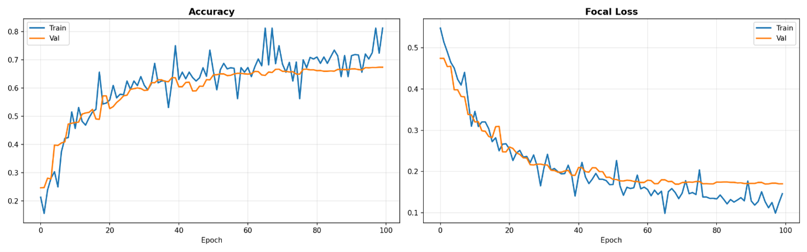
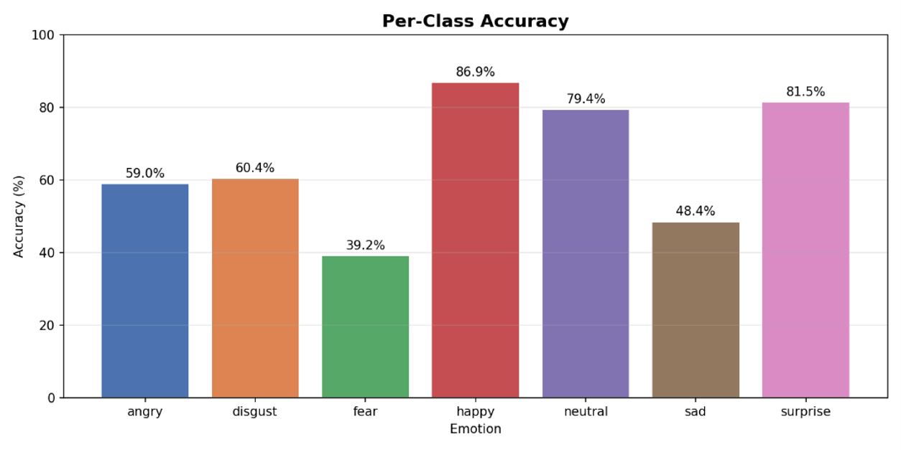
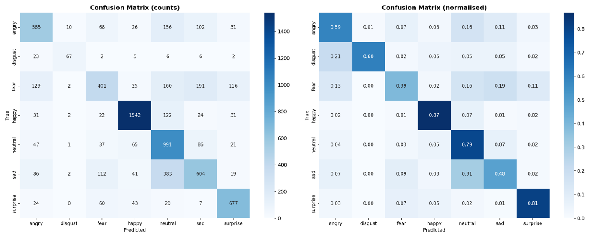
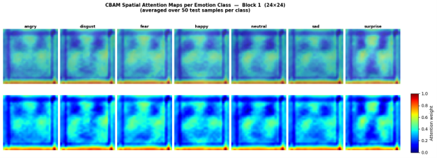
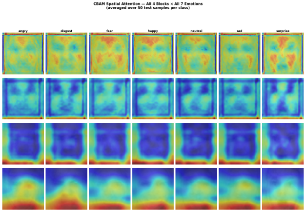

# Facial Expression Recognition
### VGG-style CNN · CBAM Attention · Focal Loss · FER2013

> Seven-class emotion recognition under severe class imbalance —  
> with per-class analysis, CBAM spatial attention visualisation, and a live web demo.

[](https://www.python.org/)
[](https://www.tensorflow.org/)
[](https://www.kaggle.com/datasets/msambare/fer2013)
[]()

---

## Overview

This project tackles the FER2013 benchmark — a notoriously noisy, class-imbalanced dataset — using a custom VGG-style CNN augmented with **CBAM (Convolutional Block Attention Module)** after each convolutional block. Rather than chasing aggregate accuracy, the design explicitly targets per-class performance under imbalance, using **Focal Loss** to shift learning focus toward underrepresented emotions.

A key design choice: **dlib 68-point face alignment** is applied as a preprocessing step, normalising facial geometry before any feature extraction begins.

A companion paper on this work is currently **under review at two international conferences (Springer Proceedings)**.

---

## Architecture

| Component      | Detail                                          |
|----------------|-------------------------------------------------|
| Backbone       | VGG-style · 4 blocks (64 → 128 → 256 → 512 filters) |
| Attention      | CBAM after each block (Channel + Spatial)       |
| Loss Function  | Focal Loss · γ = 2.0 · α = 0.25                |
| Preprocessing  | dlib 68-point facial landmark alignment         |
| Input Shape    | 48 × 48 · Grayscale                             |
| Classes        | 7 — Angry, Disgust, Fear, Happy, Neutral, Sad, Surprise |
| Training       | Google Colab · T4 GPU · 100 epochs              |

---

## Results

### Overall Performance

| Metric        | Value                          |
|---------------|-------------------------------|
| Test Accuracy | **67.38%**                    |
| Dataset Split | 28,709 train / 3,589 test     |
| Best F1       | **0.88** (Happy)              |

### Training Curves



Validation accuracy converges steadily alongside training accuracy across 100 epochs, with Focal Loss declining consistently — confirming stable learning without collapse on minority classes.

---

### Per-Class Accuracy



| Emotion  | Accuracy | Note                                      |
|----------|----------|-------------------------------------------|
| Happy    | 86.9%    | Majority class — strongest performance   |
| Surprise | 81.5%    | Strong generalisation                     |
| Neutral  | 79.4%    | Well-represented in training data         |
| Angry    | 59.0%    | Moderate — confusion with Disgust         |
| Disgust  | 60.4%    | Severe underrepresentation in FER2013     |
| Sad      | 48.4%    | High confusion with Neutral and Fear      |
| Fear     | 39.2%    | Hardest class — ambiguous visual features |

Per-class limitations are documented honestly rather than masked by aggregate metrics. Fear and Sad underperformance directly reflects FER2013's known imbalance — not a modelling failure alone.

---

### Confusion Matrix



The normalised matrix (right) reveals the primary failure modes: Fear is frequently misclassified as Sad (0.19) and Happy (0.16); Sad confuses with Neutral (0.31). These patterns are consistent with known inter-class ambiguity in posed facial expression datasets.

---

## Interpretability — CBAM Spatial Attention Maps

All attention maps below were **generated from our trained model**, averaged over 50 test samples per class per block. They are not from the original CBAM paper.

### Block 1 Attention (24 × 24)



Early-layer attention is broad, activating across the full facial region — consistent with low-level edge and texture detection at this stage.

### All 4 Blocks × All 7 Emotions



Across depth, the attention progressively localises:
- **Block 1–2:** Distributed activation across face and background
- **Block 3:** Attention concentrates toward eye and brow regions
- **Block 4:** Tight, emotion-discriminative focus — cheek lifts for Happy, brow furrows for Angry, eye widening for Surprise

This layered progression confirms CBAM is learning anatomically meaningful attention rather than background artefacts.

---

## Live Demo

### Run inference on your own photo
1. Open **FER_Inference.ipynb** in Colab
2. Run all cells top to bottom (~3 min on first run)
3. In Cell 4, upload any face photo to get a prediction

### Use the web frontend
1. Open **FER_Inference.ipynb** and run the Flask backend cell
2. Copy the ngrok URL that appears
3. Open the [live demo](https://hussainsakinah.github.io/FER-Facial-Emotion-Recognition/)
4. Paste the URL into the connection bar and click **Test**
5. Upload any photo

### Run locally
```bash
git clone https://github.com/hussainsakinah/FER-VGG-CBAM-FocalLoss.git
cd FER-VGG-CBAM-FocalLoss
pip install -r requirements.txt
python serve.py      # opens http://localhost:8000
```

---

## Dataset

[FER2013 on Kaggle](https://www.kaggle.com/datasets/msambare/fer2013)  
35,887 images · 48×48 grayscale · 7 emotion classes · Significant class imbalance

---

## Requirements

See `requirements.txt`. Key dependencies:

```
tensorflow>=2.10
opencv-python
dlib
flask
numpy
matplotlib
seaborn
```

---

## Limitations & Future Work

This project documents its failure modes explicitly:

- **Fear (39.2%) and Sad (48.4%)** remain the hardest classes due to dataset imbalance and inter-class visual ambiguity
- FER2013 itself contains noisy labels and posed rather than spontaneous expressions
- Potential directions: semi-supervised learning on unlabeled samples, class-conditional synthetic data generation to address minority class underrepresentation, and cross-dataset generalisation testing

---


*Built with TensorFlow · OpenCV · dlib · Flask*  
*Developer: Sakinah Faiza Hussain · B.Tech CSE · Malla Reddy University*  
*hussainsakinah2611@gmail.com · [github.com/hussainsakinah](https://github.com/hussainsakinah)*  
*Guide: Dr. M. Narayanan · Professor, Dept. of CSE · Malla Reddy University*
